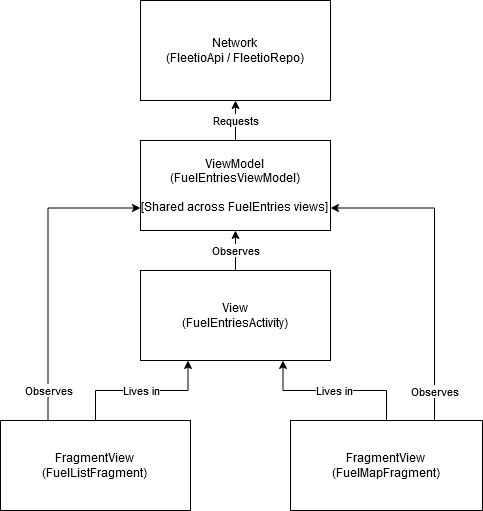

## README

## About
This repository contains a simple, single activity application containing two fragments and a bottom
navigation bar powered by Fleetio's developer API. https://developer.fleetio.com/docs/getting-started

Upon opening, users will see a list of fuel entries containing vehicle name, date, cost, cost per
mile, gallons, fuel type, price per gallon, vendor, and reference. The user can navigate between
this list view and a Google map containing the pins for the related fuel entries that have a lat long
value. The user also can perform some basic data filtering and sorting by clicking the filter icon
in the actionbar. Currently there are only 2 relatively simple filter and sort options, "require
 cost, gallons, and cost per gallon" per entry and "sort by most recent".

It was written using 100% Kotlin using a MVVM pattern.

### Libraries / Dependencies used
* Retrofit - Network calls (https://square.github.io/retrofit/)
* RxJava - Reactive functionality (http://reactivex.io/) or (https://github.com/ReactiveX/RxJava)
* Chuck - HTTP inspection (debugging) (https://github.com/jgilfelt/chuck)
* Dagger - Dependency injection (https://github.com/google/dagger)
* Glide - Image loading (https://github.com/bumptech/glide)
* ktlint - Linting / code quality (https://ktlint.github.io/)

### Steps to run
1) Follow steps at https://developer.fleetio.com/docs/getting-started to get credentials
2) Follow steps at https://developers.google.com/maps/documentation/javascript/get-api-key to get credentials
3) Pull down the project
4) Create a keystore.properties file in the root directory
5) Define AUTH_KEY and ACCOUNT_TOKEN in the keystore.properties. These keys can be obtained from your Fleetio developer account.  
5a) AUTH_KEY = "<YOUR_AUTH_KEY_HERE>"  
5b) ACCOUNT_TOKEN = "<YOUR_ACCOUNT_TOKEN_HERE>"  
6) Define GOOGLE_MAPS_KEY in the keystore.properties. This can be obtained from your Google developer account. 
6a) GOOGLE_MAPS_KEY = "<YOUR_MAPS_KEY_HERE"  
7) Build, run, profit!

### GIF
